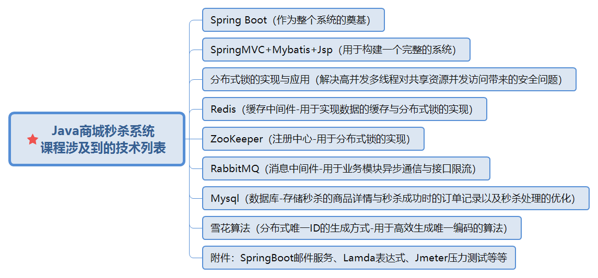

# Java商城秒杀系统设计与实战
Java秒杀项目seckill

**前言：**本系统是学习debug讲师的课程《Java商城秒杀系统设计与实战》视频后手写总结。

**系统整体介绍**：
典型且常见的高并发业务场景商城商品秒杀系统的设计与实战

## 一、项目整体简介

### 1.核心技术列表



### 2.项目业务功能介绍


### 3.项目学习收益


## 二、项目搭建

### 1.项目相关环境

需安装Redis、RabbitMQ、ZooKeeper环境（若不熟悉，可先不学此部分）。

### 2.项目准备

#### 1）数据库相关表创建

下面写出详细流程，也可以在文末下载资源，直接执行sql文件


**①item-商品表**

```mysql
# 加上if not exists使脚本可重复执行
CREATE TABLE if not exists item (
  `id` int(11) NOT NULL AUTO_INCREMENT,
  `name` varchar(255) DEFAULT NULL COMMENT '商品名',
  `code` varchar(255) DEFAULT NULL COMMENT '商品编号',
  `stock` bigint(20) DEFAULT NULL COMMENT '库存',
  `purchase_time` date DEFAULT NULL COMMENT '采购时间',
  `is_active` int(11) DEFAULT '1' COMMENT '是否有效（1=是；0=否）',
  `create_time` datetime DEFAULT NULL,
  `update_time` timestamp NULL DEFAULT NULL COMMENT '更新时间',
  PRIMARY KEY (`id`)
) ENGINE=InnoDB DEFAULT CHARSET=utf8 COMMENT='商品表';
```

**初始化数据**

```mysql
# 加上ignore，当主键重复时不再执行
INSERT ignore INTO `item` VALUES ('6', 'Java编程思想', 'book10010', '1000', '2019-05-18', '1', '2019-05-18 21:11:23', null);
INSERT ignore INTO `item` VALUES ('7', 'Spring实战第四版', 'book10011', '2000', '2019-05-18', '1', '2019-05-18 21:11:23', null);
INSERT ignore INTO `item` VALUES ('8', '深入分析JavaWeb', 'book10012', '2000', '2019-05-18', '1', '2019-05-18 21:11:23', null);
```

**②item_kill-待秒杀商品表**

```mysql
CREATE TABLE if not exists item_kill (
  `id` int(20) NOT NULL AUTO_INCREMENT COMMENT '主键id',
  `item_id` int(11) DEFAULT NULL COMMENT '商品id',
  `total` int(11) DEFAULT NULL COMMENT '可被秒杀的总数',
  `start_time` datetime DEFAULT NULL COMMENT '秒杀开始时间',
  `end_time` datetime DEFAULT NULL COMMENT '秒杀结束时间',
  `is_active` tinyint(11) DEFAULT '1' COMMENT '是否有效（1=是；0=否）',
  `create_time` timestamp NULL DEFAULT NULL COMMENT '创建的时间',
  PRIMARY KEY (`id`)
) ENGINE=InnoDB DEFAULT CHARSET=utf8 COMMENT='待秒杀商品表';
```

**初始化数据**

```mysql
INSERT ignore INTO `item_kill` VALUES ('1', '6', '10', '2019-06-08 21:59:07', '2019-06-15 21:59:11', '1', '2019-05-20 21:59:41');
INSERT ignore INTO `item_kill` VALUES ('2', '7', '0', '2019-06-01 21:59:19', '2019-06-30 21:59:11', '1', '2019-05-20 21:59:41');
INSERT ignore INTO `item_kill` VALUES ('3', '8', '97', '2019-07-01 18:58:26', '2019-07-30 21:59:07', '1', '2019-05-20 21:59:41');
```

**③item_kill_success-秒杀成功订单表**

```mysql
CREATE TABLE if not exists item_kill_success (
  `code` varchar(50) NOT NULL COMMENT '秒杀成功生成的订单编号',
  `item_id` int(11) DEFAULT NULL COMMENT '商品id',
  `kill_id` int(11) DEFAULT NULL COMMENT '秒杀id',
  `user_id` varchar(20) DEFAULT NULL COMMENT '用户id',
  `status` tinyint(4) DEFAULT '-1' COMMENT '秒杀结果: -1无效  0成功(未付款)  1已付款  2已取消',
  `create_time` timestamp NULL DEFAULT NULL COMMENT '创建时间',
  PRIMARY KEY (`code`)
) ENGINE=InnoDB DEFAULT CHARSET=utf8 COMMENT='秒杀成功订单表';
```

其余相关的表用的时候再写上

#### 2)SpringBoot搭建多模块项目

**整体结构**


**①项目初始目录结构**


**②pom.xml文件**

点击展开
<details>
<summary>1.seckill父目录下pox.xml</summary>

```xml
<?xml version="1.0" encoding="UTF-8"?>
<project xmlns="http://maven.apache.org/POM/4.0.0"
         xmlns:xsi="http://www.w3.org/2001/XMLSchema-instance"
         xsi:schemaLocation="http://maven.apache.org/POM/4.0.0 http://maven.apache.org/xsd/maven-4.0.0.xsd">
    <modelVersion>4.0.0</modelVersion>

    <groupId>org.example</groupId>
    <artifactId>seckill</artifactId>
    <packaging>pom</packaging>
    <version>1.0-SNAPSHOT</version>
    <name>基于微服务SpringBoot的商城高并发抢单系统</name>
    <description>商城高并发抢单系统-秒杀系统</description>
    
    <modules>
        <module>api</module>
        <module>model</module>
        <module>server</module>
    </modules>
    
    <properties>
        <project.build.sourceEncoding>UTF-8</project.build.sourceEncoding>
        <java.version>1.8</java.version>
        <maven.compiler.source>${java.version}</maven.compiler.source>
        <maven.compiler.target>${java.version}</maven.compiler.target>
    </properties>
</project>
```
</details>

<details>
<summary>2.api-pox.xml</summary>

```xml
<?xml version="1.0" encoding="UTF-8"?>
<project xmlns="http://maven.apache.org/POM/4.0.0"
         xmlns:xsi="http://www.w3.org/2001/XMLSchema-instance"
         xsi:schemaLocation="http://maven.apache.org/POM/4.0.0 http://maven.apache.org/xsd/maven-4.0.0.xsd">
    <parent>
        <artifactId>seckill</artifactId>
        <groupId>org.example</groupId>
        <version>1.0-SNAPSHOT</version>
    </parent>
    <modelVersion>4.0.0</modelVersion>

    <artifactId>api</artifactId>

    <properties>
        <mybatis-pagehelper.version>4.1.2</mybatis-pagehelper.version>
        <lombok.version>1.16.10</lombok.version>
        <javax-validation.version>1.1.0.Final</javax-validation.version>
        <hibernate-validator.version>5.3.5.Final</hibernate-validator.version>
    </properties>

    <dependencies>
        <!--java校验 跟 hibernate校验-->
        <dependency>
            <groupId>javax.validation</groupId>
            <artifactId>validation-api</artifactId>
            <version>${javax-validation.version}</version>
        </dependency>
        <dependency>
            <groupId>org.hibernate</groupId>
            <artifactId>hibernate-validator</artifactId>
            <version>${hibernate-validator.version}</version>
        </dependency>

        <!--for page-->
        <dependency>
            <groupId>com.github.pagehelper</groupId>
            <artifactId>pagehelper</artifactId>
            <version>${mybatis-pagehelper.version}</version>
        </dependency>

        <!--lombok-->
        <dependency>
            <groupId>org.projectlombok</groupId>
            <artifactId>lombok</artifactId>
            <version>${lombok.version}</version>
        </dependency>
    </dependencies>
</project>
```
</details>

<details>
<summary>3.model-pom.xml</summary>

```xml
<?xml version="1.0" encoding="UTF-8"?>
<project xmlns="http://maven.apache.org/POM/4.0.0"
         xmlns:xsi="http://www.w3.org/2001/XMLSchema-instance"
         xsi:schemaLocation="http://maven.apache.org/POM/4.0.0 http://maven.apache.org/xsd/maven-4.0.0.xsd">
    <parent>
        <artifactId>seckill</artifactId>
        <groupId>org.example</groupId>
        <version>1.0-SNAPSHOT</version>
    </parent>
    <modelVersion>4.0.0</modelVersion>

    <artifactId>model</artifactId>

    <properties>
        <mybatis-spring-boot.version>1.1.1</mybatis-spring-boot.version>
        <mybatis-pagehelper.version>4.1.2</mybatis-pagehelper.version>
    </properties>

    <dependencies>
        <!--api-->
        <dependency>
            <groupId>org.example</groupId>
            <artifactId>api</artifactId>
            <version>${project.parent.version}</version>
        </dependency>

        <!--spring-mybatis-->
        <dependency>
            <groupId>org.mybatis.spring.boot</groupId>
            <artifactId>mybatis-spring-boot-starter</artifactId>
            <version>${mybatis-spring-boot.version}</version>
        </dependency>

        <!--json-->
        <dependency>
            <groupId>com.fasterxml.jackson.core</groupId>
            <artifactId>jackson-annotations</artifactId>
            <version>2.9.0</version>
            <!--<scope>compile</scope>-->
        </dependency>

    </dependencies>
</project>
```
</details>

<details>
<summary>4.server-pom.xml</summary>

```xml
<?xml version="1.0" encoding="UTF-8"?>
<project xmlns="http://maven.apache.org/POM/4.0.0"
         xmlns:xsi="http://www.w3.org/2001/XMLSchema-instance"
         xsi:schemaLocation="http://maven.apache.org/POM/4.0.0 http://maven.apache.org/xsd/maven-4.0.0.xsd">
    <parent>
        <artifactId>seckill</artifactId>
        <groupId>org.example</groupId>
        <version>1.0-SNAPSHOT</version>
    </parent>
    <modelVersion>4.0.0</modelVersion>

    <artifactId>server</artifactId>

    <packaging>war</packaging>

    <properties>
        <start-class>org.example.seckill.server.MainApplication</start-class>

        <spring-boot.version>1.5.7.RELEASE</spring-boot.version>
        <spring-session.version>1.2.0.RELEASE</spring-session.version>
        <slf4j.version>1.7.13</slf4j.version>
        <log4j.version>1.2.17</log4j.version>
        <mysql.version>5.1.37</mysql.version>
        <druid.version>1.0.16</druid.version>
        <guava.version>19.0</guava.version>
        <joda-time.version>2.9.2</joda-time.version>
        <zookeeper.version>3.4.10</zookeeper.version>
        <curator.version>2.12.0</curator.version>
        <shiro.version>1.2.6</shiro.version>
        <gson.version>2.6.1</gson.version>
        <redisson.version>3.8.2</redisson.version>
        <common-lang.version>3.8</common-lang.version>

    </properties>

    <!-- 依赖管理 -->
    <dependencyManagement>
        <dependencies>
            <dependency>
                <groupId>org.springframework.boot</groupId>
                <artifactId>spring-boot-dependencies</artifactId>
                <version>${spring-boot.version}</version>
                <type>pom</type>
                <scope>import</scope>
            </dependency>
        </dependencies>
    </dependencyManagement>

    <dependencies>
        <dependency>
            <groupId>org.slf4j</groupId>
            <artifactId>slf4j-log4j12</artifactId>
            <version>${slf4j.version}</version>
        </dependency>

        <!--mail-->
        <dependency>
            <groupId>org.springframework.boot</groupId>
            <artifactId>spring-boot-starter-mail</artifactId>
            <version>${spring-boot.version}</version>
        </dependency>

        <!--model-->
        <dependency>
            <groupId>org.example</groupId>
            <artifactId>model</artifactId>
            <version>${project.parent.version}</version>
        </dependency>

        <!--guava-->
        <dependency>
            <groupId>com.google.guava</groupId>
            <artifactId>guava</artifactId>
            <version>${guava.version}</version>
        </dependency>

        <!-- time -->
        <dependency>
            <groupId>joda-time</groupId>
            <artifactId>joda-time</artifactId>
            <version>${joda-time.version}</version>
        </dependency>

        <!--mysql-->
        <dependency>
            <groupId>mysql</groupId>
            <artifactId>mysql-connector-java</artifactId>
            <version>${mysql.version}</version>
        </dependency>

        <!--druid-->
        <dependency>
            <groupId>com.alibaba</groupId>
            <artifactId>druid</artifactId>
            <version>${druid.version}</version>
        </dependency>

        <!--spring-->
        <dependency>
            <groupId>org.springframework.boot</groupId>
            <artifactId>spring-boot-starter-web</artifactId>
            <version>${spring-boot.version}</version>
            <exclusions>
                <exclusion>
                    <groupId>ch.qos.logback</groupId>
                    <artifactId>logback-classic</artifactId>
                </exclusion>
                <exclusion>
                    <groupId>org.slf4j</groupId>
                    <artifactId>log4j-over-slf4j</artifactId>
                </exclusion>
                <exclusion>
                    <groupId>org.slf4j</groupId>
                    <artifactId>slf4j-log4j12</artifactId>
                </exclusion>
                <exclusion>
                    <groupId>log4j</groupId>
                    <artifactId>log4j</artifactId>
                </exclusion>
            </exclusions>
        </dependency>

        <!-- jsp 支持 -->
        <dependency>
            <groupId>org.springframework.boot</groupId>
            <artifactId>spring-boot-starter-tomcat</artifactId>
            <scope>provided</scope>
        </dependency>

        <dependency>
            <groupId>org.apache.tomcat.embed</groupId>
            <artifactId>tomcat-embed-jasper</artifactId>
            <scope>provided</scope>
        </dependency>

        <dependency>
            <groupId>javax.servlet</groupId>
            <artifactId>jstl</artifactId>
        </dependency>


        <!-- zookeeper start -->
        <dependency>
            <groupId>org.apache.zookeeper</groupId>
            <artifactId>zookeeper</artifactId>
            <version>${zookeeper.version}</version>
            <exclusions>
                <exclusion>
                    <groupId>org.slf4j</groupId>
                    <artifactId>slf4j-log4j12</artifactId>
                </exclusion>
                <exclusion>
                    <groupId>log4j</groupId>
                    <artifactId>log4j</artifactId>
                </exclusion>
            </exclusions>
        </dependency>
        <dependency>
            <groupId>org.apache.curator</groupId>
            <artifactId>curator-framework</artifactId>
            <version>${curator.version}</version>
        </dependency>
        <dependency>
            <groupId>org.apache.curator</groupId>
            <artifactId>curator-recipes</artifactId>
            <version>${curator.version}</version>
        </dependency>

        <!--for test-->
        <dependency>
            <groupId>org.springframework.boot</groupId>
            <artifactId>spring-boot-starter-test</artifactId>
            <scope>test</scope>
        </dependency>

        <!--shiro权限控制-->
        <dependency>
            <groupId>org.apache.shiro</groupId>
            <artifactId>shiro-ehcache</artifactId>
            <version>${shiro.version}</version>
        </dependency>

        <dependency>
            <groupId>org.apache.shiro</groupId>
            <artifactId>shiro-core</artifactId>
            <version>${shiro.version}</version>
        </dependency>

        <dependency>
            <groupId>org.apache.shiro</groupId>
            <artifactId>shiro-web</artifactId>
            <version>${shiro.version}</version>
        </dependency>

        <dependency>
            <groupId>org.apache.shiro</groupId>
            <artifactId>shiro-spring</artifactId>
            <version>${shiro.version}</version>
        </dependency>

        <!-- gson -->
        <dependency>
            <groupId>com.google.code.gson</groupId>
            <artifactId>gson</artifactId>
            <version>${gson.version}</version>
        </dependency>

        <!-- redis -->
        <dependency>
            <groupId>org.springframework.boot</groupId>
            <artifactId>spring-boot-starter-redis</artifactId>
            <version>1.3.5.RELEASE</version>
        </dependency>

        <dependency>
            <groupId>commons-fileupload</groupId>
            <artifactId>commons-fileupload</artifactId>
            <version>1.3.1</version>
        </dependency>

        <dependency>
            <groupId>commons-io</groupId>
            <artifactId>commons-io</artifactId>
            <version>2.4</version>
        </dependency>

        <!--rabbitmq-->
        <dependency>
            <groupId>org.springframework.boot</groupId>
            <artifactId>spring-boot-starter-amqp</artifactId>
            <version>${spring-boot.version}</version>
        </dependency>

        <!--redisson-->
        <dependency>
            <groupId>org.redisson</groupId>
            <artifactId>redisson</artifactId>
            <version>${redisson.version}</version>
        </dependency>

        <!--common-lang3-->
        <dependency>
            <groupId>org.apache.commons</groupId>
            <artifactId>commons-lang3</artifactId>
            <version>${common-lang.version}</version>
        </dependency>

    </dependencies>

    <build>
        <finalName>seckill-${project.parent.version}</finalName>
        <plugins>
            <plugin>
                <groupId>org.springframework.boot</groupId>
                <artifactId>spring-boot-maven-plugin</artifactId>
                <version>${spring-boot.version}</version>
                <executions>
                    <execution>
                        <goals>
                            <goal>repackage</goal>
                        </goals>
                    </execution>
                </executions>
            </plugin>
            <plugin>
                <groupId>org.apache.maven.plugins</groupId>
                <artifactId>maven-war-plugin</artifactId>
                <version>2.4</version>
                <configuration>
                    <failOnMissingWebXml>false</failOnMissingWebXml>
                </configuration>
            </plugin>
        </plugins>

        <resources>
            <resource>
                <directory>src/main/resources</directory>
                <filtering>true</filtering>
            </resource>
        </resources>
    </build>
</project>
```
</details>


### 3）配置文件

**①MainApplication.class文件**

继承SpringBootServletInitializer后可以使用外部tomcat启动项目

```java
@SpringBootApplication
@ImportResource(value = {"classpath:spring/spring-jdbc.xml"})
@MapperScan(basePackages = "com.seckill.model.mapper")
public class MainAppApplication extends SpringBootServletInitializer {

    @Override
    protected SpringApplicationBuilder configure(SpringApplicationBuilder builder){
        return builder.sources(MainAppApplication.class);
    }

    public static void main(String[] args) {
        SpringApplication.run(MainAppApplication.class, args);
    }
}

```

**②配置文件**

> application.properties

```properties
#profile
#spring.profiles.active=production
#spring.profiles.active=local

#logging
logging.path=/srv/tomcat/kill/logs
logging.file=kill

spring.mvc.view.prefix=/WEB-INF/views/
spring.mvc.view.suffix=.jsp
multipart.max-request-size=20Mb
multipart.max-file-size=10Mb

logging.level.org.springframework = INFO
logging.level.com.fasterxml.jackson = INFO
logging.level.com.debug.kill = DEBUG

#json序列化配置
spring.jackson.date-format=yyyy-MM-dd HH:mm:ss
spring.jackson.time-zone=GMT+8

spring.datasource.initialize=false
spring.jmx.enabled=false

#数据源配置
datasource.url=jdbc:mysql://127.0.0.1:3306/seckill?useUnicode=true&amp;characterEncoding=utf-8&zeroDateTimeBehavior=convertToNull
datasource.username=root
datasource.password=123456

#mybatis
mybatis.config-location=classpath:mybatis-config.xml
mybatis.checkConfigLocation = true
mybatis.mapper-locations=classpath:mappers/*.xml

#redis
spring.redis.host=127.0.0.1
spring.redis.port=6379
#spring.redis.password=
redis.config.host=redis://127.0.0.1:6379

#rabbitmq
spring.rabbitmq.virtual-host=/
spring.rabbitmq.host=127.0.0.1
spring.rabbitmq.port=5672
spring.rabbitmq.username=guest
spring.rabbitmq.password=guest

spring.rabbitmq.listener.simple.concurrency=5
spring.rabbitmq.listener.simple.max-concurrency=15
spring.rabbitmq.listener.simple.prefetch=10

mq.env=test

#秒杀成功异步发送邮件的消息模型
mq.kill.item.success.email.queue=${mq.env}.kill.item.success.email.queue
mq.kill.item.success.email.exchange=${mq.env}.kill.item.success.email.exchange
mq.kill.item.success.email.routing.key=${mq.env}.kill.item.success.email.routing.key

#订单超时未支付自动失效-死信队列消息模型
mq.kill.item.success.kill.dead.queue=${mq.env}.kill.item.success.kill.dead.queue
mq.kill.item.success.kill.dead.exchange=${mq.env}.kill.item.success.kill.dead.exchange
mq.kill.item.success.kill.dead.routing.key=${mq.env}.kill.item.success.kill.dead.routing.key

mq.kill.item.success.kill.dead.real.queue=${mq.env}.kill.item.success.kill.dead.real.queue
mq.kill.item.success.kill.dead.prod.exchange=${mq.env}.kill.item.success.kill.dead.prod.exchange
mq.kill.item.success.kill.dead.prod.routing.key=${mq.env}.kill.item.success.kill.dead.prod.routing.key

#单位为ms
#mq.kill.item.success.kill.expire=10000
mq.kill.item.success.kill.expire=1800000
scheduler.expire.orders.time=30

#zookeeper
zk.host=127.0.0.1:2181
zk.namespace=kill

#发送邮件配置
spring.mail.host=smtp.qq.com
spring.mail.username=1974544863@qq.com
spring.mail.password=cmtvsjvhonkjdaje

spring.mail.properties.mail.smtp.auth=true
spring.mail.properties.mail.smtp.starttls.enable=true
spring.mail.properties.mail.smtp.starttls.required=true

mail.send.from=1974544863@qq.com

mail.kill.item.success.subject=商品抢购成功
mail.kill.item.success.content=您好，您已成功抢购到商品: <strong style="color: red">%s</strong> ，复制该链接并在浏览器采用新的页面打开，即可查看抢购详情：${system.domain.url}/kill/record/detail/%s，并请您在1个小时内完成订单的支付，超时将失效该订单哦！祝你生活愉快！

#通用配置
system.domain.url=http://localhost:8092/kill
shiro.encrypt.password.salt=11299c42bf954c0abb373efbae3f6b26
```

> log4j.properties

```properties
#Console Log
log4j.rootLogger=INFO,console,debug,info,warn,error

LOG_PATTERN=[%d{yyyy-MM-dd HH:mm:ss.SSS}] boot%X{context} - %5p [%t] --- %c{1}: %m%n

#A1--Print log to Console
log4j.appender.console=org.apache.log4j.ConsoleAppender
log4j.appender.console.Threshold=DEBUG
log4j.appender.console.layout=org.apache.log4j.PatternLayout
log4j.appender.console.layout.ConversionPattern=${LOG_PATTERN}

log4j.appender.info=org.apache.log4j.DailyRollingFileAppender
log4j.appender.info.Threshold=INFO
log4j.appender.info.File=${LOG_PATH}/${LOG_FILE}_info.log
log4j.appender.info.DatePattern='.'yyyy-MM-dd
log4j.appender.info.layout = org.apache.log4j.PatternLayout
log4j.appender.info.layout.ConversionPattern=${LOG_PATTERN}

log4j.appender.error=org.apache.log4j.DailyRollingFileAppender
log4j.appender.error.Threshold=ERROR
log4j.appender.error.File=${LOG_PATH}/${LOG_FILE}_error.log
log4j.appender.error.DatePattern='.'yyyy-MM-dd
log4j.appender.error.layout = org.apache.log4j.PatternLayout
log4j.appender.error.layout.ConversionPattern=${LOG_PATTERN}


log4j.appender.debug=org.apache.log4j.DailyRollingFileAppender
log4j.appender.debug.Threshold=DEBUG
log4j.appender.debug.File=${LOG_PATH}/${LOG_FILE}_debug.log
log4j.appender.debug.DatePattern='.'yyyy-MM-dd
log4j.appender.debug.layout = org.apache.log4j.PatternLayout
log4j.appender.debug.layout.ConversionPattern=${LOG_PATTERN}

log4j.appender.warn=org.apache.log4j.DailyRollingFileAppender
log4j.appender.warn.Threshold=WARN
log4j.appender.warn.File=${LOG_PATH}/${LOG_FILE}_warn.log
log4j.appender.warn.DatePattern='.'yyyy-MM-dd
log4j.appender.warn.layout = org.apache.log4j.PatternLayout
log4j.appender.warn.layout.ConversionPattern=${LOG_PATTERN}

log4j.logger.mqLog=INFO,mqLog
log4j.additivity.mqLog = false
log4j.appender.mqLog=org.apache.log4j.DailyRollingFileAppender
log4j.appender.mqLog.File=${LOG_PATH}/${LOG_FILE}_mqLog.log
log4j.appender.mqLog.DatePattern='.'yyyy-MM-dd
log4j.appender.mqLog.layout = org.apache.log4j.PatternLayout
log4j.appender.mqLog.layout.ConversionPattern=${LOG_PATTERN}
```

> mybatis-config.xml

```xml
<?xml version="1.0" encoding="UTF-8"?>
<!DOCTYPE configuration
        PUBLIC "-//mybatis.org//DTD Config 3.0//EN"
        "http://mybatis.org/dtd/mybatis-3-config.dtd">
<configuration>

    <settings>
        <!-- 是否使用缓存 -->
        <setting name="cacheEnabled" value="true"/>
        <!-- sql超时时间 毫秒 -->
        <setting name="defaultStatementTimeout" value="3000"/>
        <!-- 是否启用驼峰命名 -->
        <setting name="mapUnderscoreToCamelCase" value="true"/>
        <!-- 是否插入时自动生成主键 -->
        <setting name="useGeneratedKeys" value="true"/>
        <!-- 设置控制台打印sql -->
        <!--<setting name="logImpl" value="stdout_logging" />-->
    </settings>

</configuration>
```

> spring-jdbc.xml

```xml
<?xml version="1.0" encoding="UTF-8"?>
<beans xmlns="http://www.springframework.org/schema/beans"
       xmlns:xsi="http://www.w3.org/2001/XMLSchema-instance"
       xsi:schemaLocation="http://www.springframework.org/schema/beans http://www.springframework.org/schema/beans/spring-beans.xsd
       " >

    <!--主数据源 -->
    <bean id="dataSource" class="com.alibaba.druid.pool.DruidDataSource" init-method="init" destroy-method="close" primary="true" >
        <!-- 基本属性 url、user、password -->
        <property name="url" value="${datasource.url}" />
        <property name="username" value="${datasource.username}" />
        <property name="password" value="${datasource.password}" />

        <!-- 配置初始化大小、最小、最大 -->
        <property name="initialSize" value="10" />
        <property name="minIdle" value="10" />
        <property name="maxActive" value="20" />

        <!-- 配置获取连接等待超时的时间 -->
        <property name="maxWait" value="60000" />

        <!-- 配置间隔多久才进行一次检测，检测需要关闭的空闲连接，单位是毫秒 -->
        <property name="timeBetweenEvictionRunsMillis" value="60000" />

        <!-- 配置一个连接在池中最小生存的时间，单位是毫秒 -->
        <property name="minEvictableIdleTimeMillis" value="300000" />

        <property name="validationQuery" value="SELECT 1 " />
        <property name="testWhileIdle" value="true" />
        <property name="testOnBorrow" value="false" />
        <property name="testOnReturn" value="false" />

        <!-- 打开PSCache，并且指定每个连接上PSCache的大小 -->
        <property name="poolPreparedStatements" value="true" />
        <property name="maxPoolPreparedStatementPerConnectionSize" value="20" />

        <!-- 配置监控统计拦截的filters，去掉后监控界面sql无法统计 -->
        <property name="filters" value="stat" />
    </bean>

    <bean id="transactionManager" class="org.springframework.jdbc.datasource.DataSourceTransactionManager">
        <property name="dataSource" ref="dataSource"/>
    </bean>

</beans>
```

#### 4）启动项目

**启动时出现的问题：**

**问题1**：tomcat乱码：在tomcat的启动参数加上`-Dfile.encoding=UTF-8`

**问题2**：连接不上mysql数据库？

我的mysql是8.0版本的，将maven中mysql-connector-java依赖包换成8.0以上版本，driverClassName改为`com.mysql.cj.jdbc.Driver`

## 三、秒杀业务实现

jsp页面及js文件，直接拷贝到webapp目录

**整体业务流程介绍**


### 1.基础工作

#### 1）创建通用类

引入lombok包后

> @Data注解：可以给类提供get、set、equals、hascode、toString方法

**①BaseResponse返回前端对象**

```java
package com.seckill.api.response;

import com.seckill.api.enums.StatusCode;

@Data
public class BaseResponse<T> {

    private Integer code;
    private String msg;
    private T data;

    public BaseResponse(Integer code, String msg) {
        this.code = code;
        this.msg = msg;
    }

    public BaseResponse(StatusCode statusCode) {
        this.code = statusCode.getCode();
        this.msg = statusCode.getMsg();
    }

    public BaseResponse(Integer code, String msg, T data) {
        this.code = code;
        this.msg = msg;
        this.data = data;
    }
}
```

**②执行结果状态**

> 枚举类字段定义为final类型，不用生成set方法

```java
package com.seckill.api.enums;

/**
 * 通用状态码
 */
public enum StatusCode {

    Success(0,"成功"),
    Fail(-1,"失败"),
    InvalidParams(201,"非法的参数!"),
    UserNotLogin(202,"用户没登录"),
    ;

    private final Integer code;
    private final String msg;

    StatusCode(Integer code, String msg) {
        this.code = code;
        this.msg = msg;
    }

    public Integer getCode() {
        return code;
    }

    public String getMsg() {
        return msg;
    }
}
```

#### 2）创建BaseController类测试接口

```java
@Controller
@RequestMapping("/base")
public class BaseController {

	/**
     * 标准请求-响应数据格式
     * @param name
     * @return
     */
    @RequestMapping(value = "/response",method = RequestMethod.GET)
    @ResponseBody
    public BaseResponse response(String name){
        BaseResponse response=new BaseResponse(StatusCode.Success);
        if (StringUtils.isBlank(name)){
            name="这是welcome!";
        }
        response.setData(name);
        return response;
    }
}
```

**页面显示截图**：


#### 3）Mybatis逆向工程

> 利用mybatis逆向工程生成model实体、mapper接口、mapper映射文件

可以自己手敲相关代码。

这里写了一份mybatis逆向工程操作文档，很简单。

### 2.业务代码编写

#### 1）商品列表展示

**①ItemController代码**

**注意点：**

> @GetMapping(value = {"/","/index", "/list", "/index.html"})

此处代码表示可以拦截多个url请求

```java
/**
     * 获取商品列表
     */
    @GetMapping(value = {"/", "/index", "/list", "/index.html"})
    public String list(ModelMap modelMap){
        try {
            //获取待秒杀商品列表
            List<ItemKill> list=itemService.getKillItems();
            modelMap.put("list",list);

            log.info("获取待秒杀商品列表-数据：{}",list);
        }catch (Exception e){
            log.error("获取待秒杀商品列表-发生异常：",e.fillInStackTrace());
            return "redirect:/base/error";
        }
        return "list";
    }
```

**②查询待秒杀商品列表sql***

```mysql
<!-- 查询待秒杀的商品列表（商品名称、剩余数量、开始时间、结束时间、查看详情）-->
  <select id="selectAll" resultType="com.seckill.model.entity.ItemKill">
    select
    a.*, b.name,
    (
        case when(now() between a.start_time and a.end_time and total > 0)
            then 1
            else 0
        end
    ) as cankill
    from item_kill a
    left join item b on a.item_id = b.id
    where a.is_active = 1
  </select>
```

#### 2) 订单编号生成

> 对比：
>
> 传统的时间戳+流水号生成的id是无序的。
>
> snowflake生成的id整体上按照时间自增排序，并且整个分布式系统不会产生id碰撞，效率较高。

**①传统：时间戳 + N位流水号**

**注意点：**

a. ThreadLocalRandom会为每个线程维护一个seed变量，不会因为多线程竞争降低性能。

b. StringBuffer这里会不会有线程安全问题？

> 视频中讲解错误，方法里的局部变量，每个线程在调用的时候，都会创建一份新的局部变量，不会共享一个存储单元，不会线程不安全。完全可以使用StringBuilder。

```java
/**
 * 随机数生成util
 */
public class RandomUtil {

    private static final SimpleDateFormat dateFormatOne=new SimpleDateFormat("yyyyMMddHHmmssSS");

    private static final ThreadLocalRandom random=ThreadLocalRandom.current();

    /**
     * 生成订单编号-方式一
     * @return
     */
    public static String generateOrderCode(){
        // 时间戳+N为随机数流水号
        return dateFormatOne.format(DateTime.now().toDate()) + generateNumber(4);
    }

    //N为随机数流水号
    public static String generateNumber(final int num){
        StringBuffer sb=new StringBuffer();
        for (int i=1;i<=num;i++){
            sb.append(random.nextInt(9));
        }
        return sb.toString();
    }
}
```

**②雪花算法：高效率生成分布式唯一ID**

[学习链接](https://github.com/souyunku/SnowFlake)

> snowflake的结构如下(每部分用-分开):
>
> ```
> 0 - 0000000000 0000000000 0000000000 0000000000 0 - 00000 - 00000 - 000000000000
> ```
>
> 第一位未使用，接下来的41位为毫秒级时间(41位的长度可以使用69年)，然后是5位datacenterId和5位workerId(10位的长度最多支持部署1024个节点） ，最后12位是毫秒内的计数（12位的计数顺序号支持每个节点每毫秒产生4096个ID序号）
>
> 一共加起来刚好64位，为一个Long型。
>
> snowflake生成的ID整体上按照时间自增排序，并且整个分布式系统内不会产生ID碰撞（由datacenter和workerId作区分），并且效率较高

#### 3）秒杀商品核心逻辑V1

**逻辑流程为：**

①判断用户是否抢购过商品

②查询待秒杀商品并判断是否可以被秒杀

③扣减库存

④生成秒杀成功的订单通知用户秒杀成功的消息

```java
public Boolean killItem(Integer killId, Integer userId) throws Exception {
    Boolean result = false;

    //1.判断当前用户是否已经抢购过当前商品
    if (itemKillSuccessMapper.countByKillUserId(killId, userId) <= 0) {
        // 2.1查询待秒杀商品详情
        ItemKill itemKill = itemKillMapper.selectById(killId);

        // 2.2判断是否可以被秒杀canKill=1?
        if (itemKill != null && 1 == itemKill.getCanKill()) {
            // 3.扣减库存-减一
            int res = itemKillMapper.updateKillItem(killId);

            // 4.扣减是否成功?是-生成秒杀成功的订单，同时通知用户秒杀成功的消息
            if (res > 0) {
                commonRecordKillSuccessInfo(itemKill, userId);

                result = true;
            }
        }
    } else {
        throw new Exception("您已经抢购过该商品了!");
    }
    return result;
}
```

此处个人觉得代码排版不好，应改成卫语句不符合条件直接退出，减少if-else嵌套。

#### 4）整合RabbitMQ实现消息异步发送

①加入RabbitMQ依赖、配置RabbitMQ服务相关信息

②自定义注入RabbitMQ相关配置-RabbitmqConfig

③创建基本的消息模型，实现消息的发送和接收

**第①步依赖包、配置文件**

依赖包

```xml
<dependency>
    <groupId>org.springframework.boot</groupId>
    <artifactId>spring-boot-starter-amqp</artifactId>
    <version>${spring-boot.version}</version>
</dependency>
```

配置文件

```properties
# rabbitmq
spring.rabbitmq.virtual-host=/
spring.rabbitmq.host=127.0.0.1
spring.rabbitmq.port=5672
spring.rabbitmq.username=guest
spring.rabbitmq.password=guest

# 最小线程数量
spring.rabbitmq.listener.simple.concurrency=5
# 最大线程数量
spring.rabbitmq.listener.simple.max-concurrency=15
# 消费者每次从队列获取的消息数量
spring.rabbitmq.listener.simple.prefetch=10
```

**第②步RabbitmqConfig**

**a.通用化Rabbitmq配置**

```java
/**
 * 通用化 Rabbitmq 配置
 */
@Configuration
public class RabbitmqConfig {

    private final static Logger log = LoggerFactory.getLogger(RabbitmqConfig.class);

    @Autowired
    private Environment env;

    // 连接工厂
    @Autowired
    private CachingConnectionFactory connectionFactory;

    // 消费者监听器容器工厂（配置消费者实例）
    @Autowired
    private SimpleRabbitListenerContainerFactoryConfigurer factoryConfigurer;

    /**
     * 单一消费者
     * @return
     */
    @Bean(name = "singleListenerContainer")
    public SimpleRabbitListenerContainerFactory listenerContainer(){
        SimpleRabbitListenerContainerFactory factory = new SimpleRabbitListenerContainerFactory();
        factory.setConnectionFactory(connectionFactory);
        // 消息传输格式
        factory.setMessageConverter(new Jackson2JsonMessageConverter());
        // 只允许一个线程消费
        factory.setConcurrentConsumers(1);
        factory.setMaxConcurrentConsumers(1);
        // 每次只拉一条消息
        factory.setPrefetchCount(1);
        // 设置事务当中可以处理的消息数量
        factory.setTxSize(1);
        return factory;
    }

    /**
     * 多个消费者
     * @return
     */
    @Bean(name = "multiListenerContainer")
    public SimpleRabbitListenerContainerFactory multiListenerContainer(){
        SimpleRabbitListenerContainerFactory factory = new SimpleRabbitListenerContainerFactory();
        factoryConfigurer.configure(factory,connectionFactory);
        // 消息传输格式
        factory.setMessageConverter(new Jackson2JsonMessageConverter());
        // 设置consumer端的应答模式(确认消费模式-NONE)
        factory.setAcknowledgeMode(AcknowledgeMode.NONE);
        // 设置消费者实例数
        factory.setConcurrentConsumers(env.getProperty("spring.rabbitmq.listener.simple.concurrency",int.class));
        factory.setMaxConcurrentConsumers(env.getProperty("spring.rabbitmq.listener.simple.max-concurrency",int.class));
        // 设置一次拉取消息数量
        factory.setPrefetchCount(env.getProperty("spring.rabbitmq.listener.simple.prefetch",int.class));
        return factory;
    }

    @Bean
    public RabbitTemplate rabbitTemplate(){
        // 消息确认机制
        connectionFactory.setPublisherConfirms(true);
        connectionFactory.setPublisherReturns(true);

        RabbitTemplate rabbitTemplate = new RabbitTemplate(connectionFactory);

        /*
            当mandatory标志位设置为true时，如果exchange根据自身类型和消息routingKey无法找到一个合适的queue存储消息，
            那么broker会调用basic.return方法将消息返还给生产者;当mandatory设置为false时，
            出现上述情况broker会直接将消息丢弃;通俗的讲，mandatory标志告诉broker代理服务器至少将消息route到一个队列中，
            否则就将消息return给发送者;
         */
        // 设为true使ReturnCallback生效
        rabbitTemplate.setMandatory(true);
        // setReturnCallback、setConfirmCallback：return和confirm机制的回调接口
        rabbitTemplate.setConfirmCallback(new RabbitTemplate.ConfirmCallback() {
            @Override
            public void confirm(CorrelationData correlationData, boolean ack, String cause) {
                log.info("消息发送成功:correlationData({}),ack({}),cause({})",correlationData,ack,cause);
            }
        });
        rabbitTemplate.setReturnCallback(new RabbitTemplate.ReturnCallback() {
            @Override
            public void returnedMessage(Message message, int replyCode, String replyText, String exchange, String routingKey) {
                log.warn("消息丢失:exchange({}),route({}),replyCode({}),replyText({}),message:{}",exchange,routingKey,replyCode,replyText,message);
            }
        });
        return rabbitTemplate;
    }


    //构建异步发送邮箱通知的消息模型
    @Bean
    public Queue successEmailQueue(){
        return new Queue(env.getProperty("mq.kill.item.success.email.queue"),true);
    }

    @Bean
    public TopicExchange successEmailExchange(){
        return new TopicExchange(env.getProperty("mq.kill.item.success.email.exchange"),true,false);
    }

    // 绑定队列到交换机的某个路由上
    @Bean
    public Binding successEmailBinding(){
        return BindingBuilder.bind(successEmailQueue()).to(successEmailExchange()).with(env.getProperty("mq.kill.item.success.email.routing.key"));
    }
}
```

**第③步消息的发送和接收**

**a.消息发送**

```java
/**
 * 秒杀成功异步发送邮件通知消息
 */
public void sendKillSuccessEmailMsg(String orderNo) {
	log.info("秒杀成功异步发送邮件通知消息-准备发送消息：{}", orderNo);

	try {
		if (StringUtils.isNotBlank(orderNo)) {
			KillSuccessUserInfo info = itemKillSuccessMapper.selectByCode(orderNo);
			if (info != null) {
				// 1.rabbitmq发送消息的逻辑
				rabbitTemplate.setMessageConverter(new Jackson2JsonMessageConverter());
				rabbitTemplate.setExchange(env.getProperty("mq.kill.item.success.email.exchange"));
				rabbitTemplate.setRoutingKey(env.getProperty("mq.kill.item.success.email.routing.key"));

				// 2.将info充当消息发送至队列
				rabbitTemplate.convertAndSend(info, new MessagePostProcessor() {
					// 指定消息类型
					@Override
					public Message postProcessMessage(Message message) throws AmqpException {
						MessageProperties messageProperties = message.getMessageProperties();
						// 设置消息持久化
						messageProperties.setDeliveryMode(MessageDeliveryMode.PERSISTENT);
						messageProperties.setHeader(AbstractJavaTypeMapper.DEFAULT_CONTENT_CLASSID_FIELD_NAME, KillSuccessUserInfo.class);
						return message;
					}
				});
			}
		}
	} catch (Exception e) {
		log.error("秒杀成功异步发送邮件通知消息-发生异常，消息为：{}", orderNo, e.fillInStackTrace());
	}
}
```


**b.消息接收**

接收消息后处理逻辑，下面会写发送邮件服务

```java
/**
 * 秒杀异步邮件通知-接收消息
 */
@RabbitListener(queues = {"${mq.kill.item.success.email.queue}"},containerFactory = "singleListenerContainer")
public void consumeEmailMsg(KillSuccessUserInfo info){
	try {
		log.info("秒杀异步邮件通知-接收消息:{}",info);

		//TODO:真正的发送邮件(调用发送邮件服务方法)....
	}catch (Exception e){
		log.error("秒杀异步邮件通知-接收消息-发生异常：",e.fillInStackTrace());
	}
}
```

#### 5）邮件服务发送通知消息

**①加入邮件依赖、配置信息**

```xml
<!--mail-->
<dependency>
    <groupId>org.springframework.boot</groupId>
    <artifactId>spring-boot-starter-mail</artifactId>
    <version>${spring-boot.version}</version>
</dependency>
```

邮件的配置信息没有具体研究，copy引入

```properties
#发送邮件配置
spring.mail.host=smtp.qq.com
spring.mail.username=876130370@qq.com
spring.mail.password=xxxxxxxxxxx

spring.mail.properties.mail.smtp.auth=true
spring.mail.properties.mail.smtp.starttls.enable=true
spring.mail.properties.mail.smtp.starttls.required=true

mail.send.from=pioneer_chao@foxmail.com

mail.kill.item.success.subject=商品抢购成功
mail.kill.item.success.content=您好，您已成功抢购到商品: <strong style="color: red">%s</strong> ，复制该链接并在浏览器采用新的页面打开，即可查看抢购详情：${system.domain.url}/kill/record/detail/%s，并请您在1个小时内完成订单的支付，超时将失效该订单哦！祝你生活愉快！

```

**②配置邮件客户端-开启邮件服务**


**③发送邮件方法内容**

```java
/**
 * 邮件服务
 */
@Service
@EnableAsync
public class MailService {

    private static final Logger log= LoggerFactory.getLogger(MailService.class);

    @Autowired
    private JavaMailSender mailSender;

    @Autowired
    private Environment env;

    /**
     * 发送简单文本文件
     */
    @Async
    public void sendSimpleEmail(final MailDto dto){
        try {
            SimpleMailMessage message=new SimpleMailMessage();
            message.setFrom(env.getProperty("mail.send.from"));
            message.setTo(dto.getTos());
            message.setSubject(dto.getSubject());
            message.setText(dto.getContent());
            mailSender.send(message);

            log.info("发送简单文本文件-发送成功!");
        }catch (Exception e){
            log.error("发送简单文本文件-发生异常： ",e.fillInStackTrace());
        }
    }

    /**
     * 发送html格式邮件
     * @param dto
     */
    @Async
    public void sendHTMLMail(final MailDto dto){
        try {
            MimeMessage message=mailSender.createMimeMessage();
            MimeMessageHelper messageHelper=new MimeMessageHelper(message,true,"utf-8");
            messageHelper.setFrom(env.getProperty("mail.send.from"));
            messageHelper.setTo(dto.getTos());
            messageHelper.setSubject(dto.getSubject());
            messageHelper.setText(dto.getContent(),true);

            mailSender.send(message);
            log.info("发送html格式邮件-发送成功!");
        }catch (Exception e){
            log.error("发送html格式邮件-发生异常： ",e.fillInStackTrace());
        }
    }
}
```

**④测试**


#### 6）死信队列失效超时未支付的订单

**死信队列消息模型**


**①配置信息**

```properties
#订单超时未支付自动失效-死信队列消息模型
mq.kill.item.success.kill.dead.queue=${mq.env}.kill.item.success.kill.dead.queue
mq.kill.item.success.kill.dead.exchange=${mq.env}.kill.item.success.kill.dead.exchange
mq.kill.item.success.kill.dead.routing.key=${mq.env}.kill.item.success.kill.dead.routing.key

mq.kill.item.success.kill.dead.real.queue=${mq.env}.kill.item.success.kill.dead.real.queue
mq.kill.item.success.kill.dead.prod.exchange=${mq.env}.kill.item.success.kill.dead.prod.exchange
mq.kill.item.success.kill.dead.prod.routing.key=${mq.env}.kill.item.success.kill.dead.prod.routing.key

#单位为ms
#mq.kill.item.success.kill.expire=10000
```

**②队列绑定**

```java
//构建秒杀成功之后-订单超时未支付的死信队列消息模型
@Bean
public Queue successKillDeadQueue(){
    Map<String, Object> argsMap= Maps.newHashMap();
    // 死信交换机、路由
    argsMap.put("x-dead-letter-exchange",env.getProperty("mq.kill.item.success.kill.dead.exchange"));
    argsMap.put("x-dead-letter-routing-key",env.getProperty("mq.kill.item.success.kill.dead.routing.key"));
    // ttl
    // argsMap.put("x-message-ttl", 10000);
    return new Queue(env.getProperty("mq.kill.item.success.kill.dead.queue"),true,false,false,argsMap);
}

//基本交换机
@Bean
public TopicExchange successKillDeadProdExchange(){
    return new TopicExchange(env.getProperty("mq.kill.item.success.kill.dead.prod.exchange"),true,false);
}

//创建基本交换机+基本路由 -> 死信队列 的绑定
@Bean
public Binding successKillDeadProdBinding(){
    return BindingBuilder.bind(successKillDeadQueue()).to(successKillDeadProdExchange()).with(env.getProperty("mq.kill.item.success.kill.dead.prod.routing.key"));
}

//真正的队列
@Bean
public Queue successKillRealQueue(){
    return new Queue(env.getProperty("mq.kill.item.success.kill.dead.real.queue"),true);
}

//死信交换机
@Bean
public TopicExchange successKillDeadExchange(){
    return new TopicExchange(env.getProperty("mq.kill.item.success.kill.dead.exchange"),true,false);
}

//死信交换机+死信路由->真正队列 的绑定
@Bean
public Binding successKillDeadBinding(){
    return BindingBuilder.bind(successKillRealQueue()).to(successKillDeadExchange()).with(env.getProperty("mq.kill.item.success.kill.dead.routing.key"));
}
```

**③消息发送**

```java
/**
 * 秒杀成功后生成抢购订单-发送信息入死信队列，等待着一定时间失效超时未支付的订单
 *
 * @param orderCode
 */
public void sendKillSuccessOrderExpireMsg(final String orderCode) {
	try {
		if (StringUtils.isNotBlank(orderCode)) {
			KillSuccessUserInfo info = itemKillSuccessMapper.selectByCode(orderCode);
			if (info != null) {
				rabbitTemplate.setMessageConverter(new Jackson2JsonMessageConverter());
				rabbitTemplate.setExchange(env.getProperty("mq.kill.item.success.kill.dead.prod.exchange"));
				rabbitTemplate.setRoutingKey(env.getProperty("mq.kill.item.success.kill.dead.prod.routing.key"));
				rabbitTemplate.convertAndSend(info, new MessagePostProcessor() {
					@Override
					public Message postProcessMessage(Message message) throws AmqpException {
						MessageProperties mp = message.getMessageProperties();
						mp.setDeliveryMode(MessageDeliveryMode.PERSISTENT);
						mp.setHeader(AbstractJavaTypeMapper.DEFAULT_CONTENT_CLASSID_FIELD_NAME, KillSuccessUserInfo.class);

						//TODO：动态设置TTL(为了测试方便，暂且设置10s)
						mp.setExpiration(env.getProperty("mq.kill.item.success.kill.expire"));
						return message;
					}
				});
			}
		}
	} catch (Exception e) {
		log.error("秒杀成功后生成抢购订单-发送信息入死信队列，等待着一定时间失效超时未支付的订单-发生异常，消息为：{}", orderCode, e.fillInStackTrace());
	}
}
```

**④消息接收**

```java
/**
 * 用户秒杀成功后超时未支付-监听者
 * @param info
 */
@RabbitListener(queues = {"${mq.kill.item.success.kill.dead.real.queue}"},containerFactory = "singleListenerContainer")
public void consumeExpireOrder(KillSuccessUserInfo info){
	try {
		log.info("用户秒杀成功后超时未支付-监听者-接收消息:{}",info);

		if (info!=null){
			ItemKillSuccess entity=itemKillSuccessMapper.selectByPrimaryKey(info.getCode());
			if (entity!=null && entity.getStatus().intValue()==0){
				itemKillSuccessMapper.expireOrder(info.getCode());
			}
		}
	}catch (Exception e){
		log.error("用户秒杀成功后超时未支付-监听者-发生异常：",e.fillInStackTrace());
	}
}
```

**⑤测试**

管控台可以看到10秒后，消息由死信队列进入普通队列

#### 7）定时任务提高安全性--处理死信队列未工作情况

**详解：**

> RabbitMQ死信队列缺陷：许多订单在某个ttl集中失效，此时RabbitMQ服务挂了
>
> 解决方法：
>
> 1.可以通过RabbitMQ集群，提高安全性
>
> 2.定时任务补偿处理-批量获取status=0订单并判断时间超过了ttl

**①代码编写**

```java
/**
 * 定时任务服务
 */
@Service
public class SchedulerService {

    private static final Logger log= LoggerFactory.getLogger(SchedulerService.class);

    @Autowired
    private ItemKillSuccessMapper itemKillSuccessMapper;

    @Autowired
    private Environment env;

    /**
     * 定时获取status=0的订单并判断是否超过TTL，然后进行失效
     */
    @Scheduled(cron = "0/10 * * * * ?")
    public void schedulerExpireOrders(){
        log.info("v1的定时任务----");
        try {
            List<ItemKillSuccess> list=itemKillSuccessMapper.selectExpireOrders();
            if (list!=null && !list.isEmpty()){
                //java8的写法
                list.stream().forEach(i -> {
                    if (i!=null && i.getDiffTime() > env.getProperty("scheduler.expire.orders.time",Integer.class)){
                        itemKillSuccessMapper.expireOrder(i.getCode());
                    }
                });
            }
        }catch (Exception e){
            log.error("定时获取status=0的订单并判断是否超过TTL，然后进行失效-发生异常：",e.fillInStackTrace());
        }
    }
}
```

**注意点**

> 需要在启动类上加上@EnableScheduling注解开启定时任务；
>
> @Scheduled(cron = "0/10 * * * * ?")
>
> cron表达式可以搜索在线生成

**②定时任务优化-多线程处理**

结合线程池一起使用，规避单一线程处理多个任务调度的缺陷。

**定时任务多线程处理通用化配置**

```java
/**
 * 定时任务多线程处理的通用化配置
 */
@Configuration
public class SchedulerConfig implements SchedulingConfigurer{

    @Override
    public void configureTa
